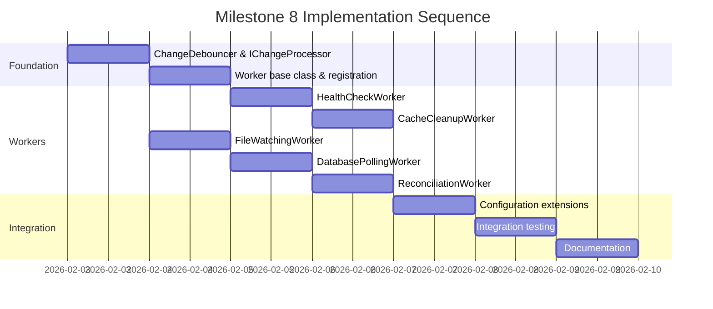

# Milestone 8: Background Workers & Change Detection – Implementation Plan

This document provides a comprehensive implementation and testing plan for Milestone 8, which introduces background workers and automated change detection to the SQL Project Synchronization service.

---

## Table of Contents

1. [Milestone Overview](#1-milestone-overview)
2. [Architecture & Design](#2-architecture--design)
3. [Implementation Plan](#3-implementation-plan)
4. [Testing Strategy](#4-testing-strategy)
5. [Definition of Done](#5-definition-of-done)
6. [Risks & Mitigations](#6-risks--mitigations)

---

## 1. Milestone Overview

### 1.1 Scope and Objectives

Milestone 8 transforms the service from a manual, on-demand comparison system to an automated, event-driven change detection platform. The primary objectives are:

1. **Automated Database Monitoring** – Detect schema changes in SQL Server by polling `sys.objects` for `modify_date` updates.
2. **File System Monitoring** – Watch project folders for SQL file changes using `FileSystemWatcher`.
3. **Intelligent Change Aggregation** – Debounce rapid changes to prevent excessive comparisons.
4. **Periodic Reconciliation** – Ensure no changes are missed with scheduled full comparisons.
5. **Resource Management** – Clean up old snapshots and history to manage storage.
6. **Health Monitoring** – Continuously verify subscription connectivity and health.

### 1.2 Dependencies on Milestone 7

Milestone 8 builds directly on Milestone 7's foundation:

| Milestone 7 Component | Usage in Milestone 8 |
|-----------------------|----------------------|
| `ComparisonOrchestrator` | Triggered by workers when changes are detected |
| `ISubscriptionRepository` | Query active subscriptions for monitoring |
| `ISchemaSnapshotRepository` | Retention/cleanup management |
| `IComparisonHistoryRepository` | Retention/cleanup management |
| `IPendingChangeRepository` | Store and process detected changes |
| `ComparisonOptions.AutoCompare` | Controls whether workers trigger comparisons |
| `ComparisonOptions.CompareOnFileChange` | Controls file-triggered comparisons |
| `ComparisonOptions.CompareOnDatabaseChange` | Controls database-triggered comparisons |

### 1.3 Expected Deliverables

| Deliverable | Description |
|-------------|-------------|
| 5 Background Workers | `DatabasePollingWorker`, `FileWatchingWorker`, `ReconciliationWorker`, `CacheCleanupWorker`, `HealthCheckWorker` |
| Change Detection Pipeline | `ChangeDebouncer`, `IChangeProcessor` |
| Configuration Extensions | New settings for worker intervals, retention policies |
| Updated Tests | Unit + integration tests for all workers |
| Updated Documentation | TESTING-GUIDE.md updated for background capabilities |

### 1.4 Success Criteria

- [ ] All 5 workers run as hosted services without blocking API requests
- [ ] File changes trigger comparisons within debounce window (default 500ms)
- [ ] Database changes trigger comparisons on next poll cycle (default 30s)
- [ ] Periodic reconciliation runs every 5 minutes (configurable)
- [ ] Cache cleanup enforces retention policies hourly
- [ ] Health checks update subscription health every 60 seconds
- [ ] All existing 149+ tests continue to pass
- [ ] New tests achieve >80% coverage of worker code

---

## 2. Architecture & Design

### 2.1 High-Level Architecture

```
┌─────────────────────────────────────────────────────────────────────────────┐
│                              ASP.NET Core Host                               │
├─────────────────────────────────────────────────────────────────────────────┤
│  ┌─────────────────┐  ┌─────────────────┐  ┌─────────────────┐              │
│  │   API Layer     │  │  SignalR Hub    │  │ Background      │              │
│  │  (Controllers)  │  │  (SyncHub)      │  │ Services        │              │
│  └────────┬────────┘  └────────┬────────┘  └────────┬────────┘              │
│           │                    │                    │                        │
│           └──────────────────┬─┴────────────────────┘                        │
│                              │                                               │
│  ┌───────────────────────────▼───────────────────────────────────────────┐  │
│  │                    ComparisonOrchestrator                              │  │
│  │  (Queues comparisons, enforces concurrency, persists results)         │  │
│  └───────────────────────────────────────────────────────────────────────┘  │
│                              │                                               │
│  ┌───────────────────────────▼───────────────────────────────────────────┐  │
│  │                    Change Detection Pipeline                           │  │
│  │  ┌─────────────────┐  ┌─────────────────┐  ┌─────────────────┐        │  │
│  │  │ ChangeDebouncer │→ │ DetectedChange  │→ │ ChangeProcessor │        │  │
│  │  │ (aggregation)   │  │ (domain model)  │  │ (triggers comp) │        │  │
│  │  └─────────────────┘  └─────────────────┘  └─────────────────┘        │  │
│  └───────────────────────────────────────────────────────────────────────┘  │
│                                                                              │
│  ┌───────────────────────────────────────────────────────────────────────┐  │
│  │                         Background Workers                             │  │
│  │  ┌──────────────┐ ┌──────────────┐ ┌──────────────┐ ┌──────────────┐  │  │
│  │  │ DatabasePoll │ │ FileWatching │ │ Reconcile    │ │ CacheCleanup │  │  │
│  │  │ Worker       │ │ Worker       │ │ Worker       │ │ Worker       │  │  │
│  │  └──────────────┘ └──────────────┘ └──────────────┘ └──────────────┘  │  │
│  │                          ┌──────────────┐                              │  │
│  │                          │ HealthCheck  │                              │  │
│  │                          │ Worker       │                              │  │
│  │                          └──────────────┘                              │  │
│  └───────────────────────────────────────────────────────────────────────┘  │
│                                                                              │
│  ┌───────────────────────────────────────────────────────────────────────┐  │
│  │                         Persistence Layer                              │  │
│  │  Subscriptions │ SchemaSnapshots │ ComparisonHistory │ PendingChanges │  │
│  └───────────────────────────────────────────────────────────────────────┘  │
└─────────────────────────────────────────────────────────────────────────────┘
```

### 2.2 Background Worker Designs

#### 2.2.1 DatabasePollingWorker

**Purpose**: Detect database schema changes by periodically querying SQL Server metadata.

**Design**:
```csharp
public sealed class DatabasePollingWorker : BackgroundService
{
    private readonly IServiceProvider _serviceProvider;
    private readonly ILogger<DatabasePollingWorker> _logger;
    private readonly TimeSpan _pollInterval;

    // Track last known modify_date per subscription
    private readonly ConcurrentDictionary<Guid, DateTime> _lastKnownModifyDates = new();

    protected override async Task ExecuteAsync(CancellationToken stoppingToken)
    {
        using var timer = new PeriodicTimer(_pollInterval);
        while (await timer.WaitForNextTickAsync(stoppingToken))
        {
            await PollAllActiveSubscriptionsAsync(stoppingToken);
        }
    }
}
```

**Polling Query**:
```sql
SELECT MAX(modify_date) AS LatestModifyDate
FROM sys.objects
WHERE type IN ('U', 'V', 'P', 'FN', 'IF', 'TF', 'TR')  -- Tables, Views, Procs, Functions, Triggers
```

**Behavior**:
1. Query all active subscriptions from `ISubscriptionRepository`
2. For each subscription with `CompareOnDatabaseChange = true`:
   - Connect to database using stored credentials
   - Execute metadata query to get latest `modify_date`
   - Compare against cached `_lastKnownModifyDates[subscriptionId]`
   - If newer: record `DetectedChange` and optionally trigger comparison
3. Emit `DatabaseChanged` SignalR event when changes detected

**Error Handling**:
- Connection failures update subscription health but don't stop the worker
- Transient failures are logged and retried on next poll cycle
- Fatal configuration errors (e.g., invalid credentials) mark subscription as unhealthy

---

#### 2.2.2 FileWatchingWorker

**Purpose**: Monitor SQL project folders for file changes in real-time.

**Design**:
```csharp
public sealed class FileWatchingWorker : BackgroundService
{
    private readonly IServiceProvider _serviceProvider;
    private readonly ILogger<FileWatchingWorker> _logger;
    private readonly IChangeDebouncer _debouncer;

    // One watcher per active subscription
    private readonly ConcurrentDictionary<Guid, FileSystemWatcher> _watchers = new();

    protected override async Task ExecuteAsync(CancellationToken stoppingToken)
    {
        await InitializeWatchersAsync(stoppingToken);

        // Keep service running and handle subscription changes
        using var timer = new PeriodicTimer(TimeSpan.FromSeconds(30));
        while (await timer.WaitForNextTickAsync(stoppingToken))
        {
            await SyncWatchersWithActiveSubscriptionsAsync(stoppingToken);
        }
    }
}
```

**FileSystemWatcher Configuration**:
```csharp
private FileSystemWatcher CreateWatcher(Subscription subscription)
{
    var watcher = new FileSystemWatcher(subscription.Project.Path)
    {
        Filter = "*.sql",
        IncludeSubdirectories = true,
        EnableRaisingEvents = true,
        NotifyFilter = NotifyFilters.LastWrite | NotifyFilters.FileName | NotifyFilters.DirectoryName
    };

    watcher.Changed += (s, e) => OnFileChanged(subscription.Id, e, ChangeType.Modified);
    watcher.Created += (s, e) => OnFileChanged(subscription.Id, e, ChangeType.Created);
    watcher.Deleted += (s, e) => OnFileChanged(subscription.Id, e, ChangeType.Deleted);
    watcher.Renamed += (s, e) => OnFileRenamed(subscription.Id, e);
    watcher.Error += (s, e) => OnWatcherError(subscription.Id, e);

    return watcher;
}
```

**Behavior**:
1. On startup, create `FileSystemWatcher` for each active subscription with `CompareOnFileChange = true`
2. Pipe all file events through `ChangeDebouncer` to aggregate rapid changes
3. After debounce window closes, record `DetectedChange` entries
4. Trigger comparison if subscription has `AutoCompare = true`
5. Emit `FileChanged` SignalR event

**Lifecycle Management**:
- Add watchers when subscriptions are created/resumed
- Remove watchers when subscriptions are paused/deleted
- Recreate watchers if folder path changes

---

#### 2.2.3 ReconciliationWorker

**Purpose**: Perform periodic full comparisons to catch any missed changes.

**Design**:
```csharp
public sealed class ReconciliationWorker : BackgroundService
{
    private readonly IServiceProvider _serviceProvider;
    private readonly ILogger<ReconciliationWorker> _logger;
    private readonly TimeSpan _reconciliationInterval;

    protected override async Task ExecuteAsync(CancellationToken stoppingToken)
    {
        // Initial delay to let service stabilize
        await Task.Delay(TimeSpan.FromMinutes(1), stoppingToken);

        using var timer = new PeriodicTimer(_reconciliationInterval);
        while (await timer.WaitForNextTickAsync(stoppingToken))
        {
            await ReconcileAllActiveSubscriptionsAsync(stoppingToken);
        }
    }
}
```

**Behavior**:
1. Every 5 minutes (configurable), enumerate all active subscriptions with `AutoCompare = true`
2. For each subscription:
   - Skip if a comparison was triggered within the last reconciliation interval
   - Run full comparison via `ComparisonOrchestrator.RunComparisonAsync(id, fullComparison: true)`
3. Update subscription's `LastComparedAt` timestamp
4. Process any accumulated `PendingChanges` and mark as processed

**Staggering**:
- To avoid thundering herd, introduce random jitter (0-30s) per subscription
- Respect `MaxConcurrentComparisons` limit

---

#### 2.2.4 CacheCleanupWorker

**Purpose**: Enforce retention policies for snapshots and comparison history.

**Design**:
```csharp
public sealed class CacheCleanupWorker : BackgroundService
{
    private readonly IServiceProvider _serviceProvider;
    private readonly ILogger<CacheCleanupWorker> _logger;
    private readonly CacheSettings _cacheSettings;

    protected override async Task ExecuteAsync(CancellationToken stoppingToken)
    {
        using var timer = new PeriodicTimer(TimeSpan.FromHours(1));
        while (await timer.WaitForNextTickAsync(stoppingToken))
        {
            await CleanupAsync(stoppingToken);
        }
    }
}
```

**Retention Policies** (from `CacheSettings`):
- `SnapshotRetention`: Delete snapshots older than 7 days (default)
- `MaxCachedSnapshots`: Keep at most 10 snapshots per subscription (default)
- `ComparisonHistoryRetention`: (New) Delete comparison results older than 30 days

**Cleanup Actions**:
1. Query `SchemaSnapshots` per subscription, ordered by `CapturedAt` descending
2. Delete snapshots exceeding count limit or age threshold
3. Query `ComparisonHistory`, delete entries older than retention period
4. Delete processed `PendingChanges` older than 24 hours
5. Compact LiteDB file to reclaim space

---

#### 2.2.5 HealthCheckWorker

**Purpose**: Monitor subscription health (database connectivity, folder accessibility).

**Design**:
```csharp
public sealed class HealthCheckWorker : BackgroundService
{
    private readonly IServiceProvider _serviceProvider;
    private readonly ILogger<HealthCheckWorker> _logger;
    private readonly TimeSpan _healthCheckInterval;

    protected override async Task ExecuteAsync(CancellationToken stoppingToken)
    {
        using var timer = new PeriodicTimer(_healthCheckInterval);
        while (await timer.WaitForNextTickAsync(stoppingToken))
        {
            await CheckAllSubscriptionsAsync(stoppingToken);
        }
    }
}
```

**Health Checks**:
1. **Database Connectivity**: Attempt connection with 5-second timeout
2. **Folder Accessibility**: Verify folder exists and is readable
3. **SQL File Presence**: Confirm at least one `.sql` file exists

**Health Status Model**:
```csharp
public class SubscriptionHealth
{
    public bool DatabaseConnectable { get; set; }
    public bool FolderAccessible { get; set; }
    public DateTime LastCheckedAt { get; set; }
    public string? LastError { get; set; }
    public HealthStatus OverallStatus { get; set; }  // Healthy, Degraded, Unhealthy
}
```

**Behavior**:
- Update `Subscription.Health` in repository
- Emit `SubscriptionHealthChanged` SignalR event when status changes
- Do not pause subscriptions automatically (leave that decision to users)

---

### 2.3 Change Detection Pipeline

#### 2.3.1 ChangeDebouncer

**Purpose**: Aggregate rapid file system events into batches.

**Design**:
```csharp
public interface IChangeDebouncer
{
    void RecordChange(Guid subscriptionId, string objectIdentifier, ChangeSource source, ChangeType type);
    event EventHandler<PendingChangeBatch> BatchReady;
}

public sealed class ChangeDebouncer : IChangeDebouncer, IDisposable
{
    private readonly TimeSpan _debounceWindow;
    private readonly ConcurrentDictionary<Guid, DebounceState> _subscriptionStates = new();

    public event EventHandler<PendingChangeBatch>? BatchReady;

    public void RecordChange(Guid subscriptionId, string objectIdentifier, ChangeSource source, ChangeType type)
    {
        var state = _subscriptionStates.GetOrAdd(subscriptionId, _ => new DebounceState());
        state.AddChange(objectIdentifier, source, type);
        state.ResetTimer(_debounceWindow, () => FlushBatch(subscriptionId));
    }
}
```

**Debounce Logic**:
1. When a change arrives, add to pending batch for that subscription
2. Reset (or start) a timer for `FileSystemDebounce` duration (default 500ms)
3. When timer fires, emit `BatchReady` event with all accumulated changes
4. Clear the pending batch and stop timer

**Deduplication**:
- Multiple changes to the same file within the debounce window are collapsed
- Last `ChangeType` wins (e.g., Create → Modify → Delete = Delete)

---

#### 2.3.2 IChangeProcessor

**Purpose**: Process batches of detected changes and trigger comparisons.

**Design**:
```csharp
public interface IChangeProcessor
{
    Task ProcessBatchAsync(PendingChangeBatch batch, CancellationToken cancellationToken = default);
}

public sealed class ChangeProcessor : IChangeProcessor
{
    private readonly ISubscriptionRepository _subscriptionRepository;
    private readonly IPendingChangeRepository _pendingChangeRepository;
    private readonly IComparisonOrchestrator _comparisonOrchestrator;
    private readonly IHubContext<SyncHub> _hubContext;

    public async Task ProcessBatchAsync(PendingChangeBatch batch, CancellationToken cancellationToken = default)
    {
        // 1. Persist all changes to PendingChanges collection
        foreach (var change in batch.Changes)
        {
            await _pendingChangeRepository.AddAsync(change, cancellationToken);
        }

        // 2. Get subscription and check options
        var subscription = await _subscriptionRepository.GetByIdAsync(batch.SubscriptionId, cancellationToken);
        if (subscription is null || !subscription.IsActive()) return;

        // 3. Determine if comparison should be triggered
        var shouldCompare = ShouldTriggerComparison(subscription, batch);

        if (shouldCompare)
        {
            try
            {
                await _comparisonOrchestrator.RunComparisonAsync(batch.SubscriptionId, fullComparison: false, cancellationToken);

                // Mark changes as processed
                foreach (var change in batch.Changes)
                {
                    await _pendingChangeRepository.MarkAsProcessedAsync(change.Id, cancellationToken);
                }
            }
            catch (ComparisonInProgressException)
            {
                // Leave changes unprocessed; they'll be picked up by reconciliation
            }
        }
    }

    private bool ShouldTriggerComparison(Subscription subscription, PendingChangeBatch batch)
    {
        if (!subscription.Options.AutoCompare) return false;

        var hasFileChanges = batch.Changes.Any(c => c.Source == ChangeSource.FileSystem);
        var hasDbChanges = batch.Changes.Any(c => c.Source == ChangeSource.Database);

        return (hasFileChanges && subscription.Options.CompareOnFileChange)
            || (hasDbChanges && subscription.Options.CompareOnDatabaseChange);
    }
}
```

---

### 2.4 Integration Points

| Component | Integration Point |
|-----------|-------------------|
| `ComparisonOrchestrator` | Workers call `RunComparisonAsync` to trigger comparisons |
| `ISubscriptionRepository` | Workers query active subscriptions |
| `IPendingChangeRepository` | Store and track detected changes |
| `ISchemaSnapshotRepository` | CacheCleanupWorker enforces retention |
| `IComparisonHistoryRepository` | CacheCleanupWorker enforces retention |
| `IHubContext<SyncHub>` | Emit real-time events (Milestone 9 integration point) |
| `ServiceConfiguration` | Workers read intervals from config |

---

### 2.5 Concurrency and Thread-Safety Considerations

| Concern | Mitigation |
|---------|------------|
| **Multiple workers accessing repositories** | LiteDB is thread-safe; repositories are scoped services |
| **FileSystemWatcher events on thread pool** | Events are queued through debouncer, processed sequentially per subscription |
| **Concurrent comparisons** | `ComparisonOrchestrator` uses `SemaphoreSlim` with `MaxConcurrentComparisons` |
| **Race between API and workers** | Optimistic concurrency; `ComparisonInProgressException` if conflict |
| **Worker lifecycle during shutdown** | `CancellationToken` propagated; workers complete current iteration gracefully |
| **Watcher dictionary access** | Use `ConcurrentDictionary` for thread-safe watcher management |

---

## 3. Implementation Plan

### 3.1 Implementation Sequence



### 3.2 Code Structure & File Organization

```
src/SqlSyncService/
├── ChangeDetection/
│   ├── ChangeDebouncer.cs           # NEW - Aggregates rapid changes
│   ├── IChangeDebouncer.cs          # NEW - Interface
│   ├── ChangeProcessor.cs           # NEW - Processes batches, triggers comparisons
│   ├── IChangeProcessor.cs          # NEW - Interface
│   └── DatabaseMetadataPoller.cs    # NEW - Executes sys.objects queries
├── BackgroundTasks/
│   ├── DatabasePollingWorker.cs     # NEW
│   ├── FileWatchingWorker.cs        # NEW
│   ├── ReconciliationWorker.cs      # NEW
│   ├── CacheCleanupWorker.cs        # NEW
│   └── HealthCheckWorker.cs         # NEW
├── Configuration/
│   └── ServiceConfiguration.cs      # MODIFIED - Add new settings
├── Domain/
│   ├── Changes/
│   │   └── DetectedChange.cs        # EXISTS - Add SubscriptionHealth
│   └── Subscriptions/
│       └── Subscription.cs          # MODIFIED - Add Health property
├── Persistence/
│   ├── PendingChangeRepository.cs   # EXISTS - Add cleanup methods
│   └── interfaces updated           # MODIFIED
└── Program.cs                        # MODIFIED - Register workers
```

### 3.3 Key Classes and Responsibilities

| Class | Responsibility |
|-------|----------------|
| `IChangeDebouncer` | Aggregate rapid changes within configurable time window |
| `ChangeDebouncer` | Implementation using `ConcurrentDictionary` and `Timer` |
| `IChangeProcessor` | Process change batches and decide whether to trigger comparison |
| `ChangeProcessor` | Persist changes, check subscription options, invoke orchestrator |
| `DatabasePollingWorker` | Poll SQL Server metadata for schema changes |
| `FileWatchingWorker` | Manage `FileSystemWatcher` instances per subscription |
| `ReconciliationWorker` | Periodic full comparisons for all active subscriptions |
| `CacheCleanupWorker` | Enforce snapshot and history retention policies |
| `HealthCheckWorker` | Verify database and folder accessibility |
| `DatabaseMetadataPoller` | Execute SQL queries against `sys.objects` |

### 3.4 Configuration Options

**New/Extended `appsettings.json` entries**:

```json
{
  "Service": {
    "Monitoring": {
      "DatabasePollInterval": "00:00:30",
      "FileSystemDebounce": "00:00:00.500",
      "FullReconciliationInterval": "00:05:00",
      "HealthCheckInterval": "00:01:00",
      "MaxConcurrentComparisons": 2
    },
    "Cache": {
      "CacheDirectory": "./cache",
      "SnapshotRetention": "7.00:00:00",
      "MaxCachedSnapshots": 10,
      "ComparisonHistoryRetention": "30.00:00:00",
      "PendingChangeRetention": "1.00:00:00"
    },
    "Workers": {
      "EnableDatabasePolling": true,
      "EnableFileWatching": true,
      "EnableReconciliation": true,
      "EnableCacheCleanup": true,
      "EnableHealthChecks": true
    }
  }
}
```

---

## 4. Testing Strategy

### 4.1 Unit Tests for Each Worker

#### 4.1.1 ChangeDebouncer Tests

```csharp
[Fact]
public async Task RecordChange_EmitsBatchAfterDebounceWindow()
{
    var debouncer = new ChangeDebouncer(TimeSpan.FromMilliseconds(100));
    PendingChangeBatch? receivedBatch = null;
    debouncer.BatchReady += (s, batch) => receivedBatch = batch;

    debouncer.RecordChange(subscriptionId, "dbo.Table1", ChangeSource.FileSystem, ChangeType.Modified);

    await Task.Delay(150);

    Assert.NotNull(receivedBatch);
    Assert.Single(receivedBatch.Changes);
}

[Fact]
public async Task RecordChange_AggregatesMultipleChangesWithinWindow()
{
    // Multiple changes to same file within 100ms debounce window
    // Should result in single batch with consolidated changes
}

[Fact]
public async Task RecordChange_DeduplicatesSameFileChanges()
{
    // Create -> Modify -> Delete within window = just Delete
}
```

#### 4.1.2 DatabasePollingWorker Tests

```csharp
[Fact]
public async Task ExecuteAsync_SkipsInactiveSubscriptions()
{
    // Mock subscription with State = Paused
    // Verify no database connection attempted
}

[Fact]
public async Task ExecuteAsync_DetectsChangesWhenModifyDateIncreases()
{
    // First poll: modify_date = 2026-02-01
    // Second poll: modify_date = 2026-02-02
    // Verify DetectedChange recorded and comparison triggered
}

[Fact]
public async Task ExecuteAsync_HandlesConnectionFailureGracefully()
{
    // Mock failed database connection
    // Verify worker continues, subscription marked unhealthy
}

[Fact]
public async Task ExecuteAsync_RespectsCompareOnDatabaseChangeOption()
{
    // Subscription with CompareOnDatabaseChange = false
    // Verify no comparison triggered even when change detected
}
```

#### 4.1.3 FileWatchingWorker Tests

```csharp
[Fact]
public async Task ExecuteAsync_CreatesWatcherForActiveSubscription()
{
    // Mock subscription repository with one active subscription
    // Verify FileSystemWatcher created for project path
}

[Fact]
public async Task ExecuteAsync_RemovesWatcherWhenSubscriptionPaused()
{
    // Start with active subscription
    // Pause subscription
    // Verify watcher disposed
}

[Fact]
public async Task FileChanged_TriggersDebouncer()
{
    // Simulate file change event
    // Verify ChangeDebouncer.RecordChange called
}

[Fact]
public async Task FileChanged_RespectsCompareOnFileChangeOption()
{
    // Subscription with CompareOnFileChange = false
    // Verify change recorded but no comparison triggered
}
```

#### 4.1.4 ReconciliationWorker Tests

```csharp
[Fact]
public async Task ExecuteAsync_RunsFullComparisonForAllActiveSubscriptions()
{
    // Mock 3 active subscriptions with AutoCompare = true
    // Verify ComparisonOrchestrator.RunComparisonAsync called 3 times
}

[Fact]
public async Task ExecuteAsync_SkipsRecentlyComparedSubscriptions()
{
    // Subscription compared 2 minutes ago, reconciliation interval = 5 minutes
    // Verify comparison skipped
}

[Fact]
public async Task ExecuteAsync_ProcessesPendingChanges()
{
    // Pending changes exist from previous file watching
    // Verify changes marked as processed after comparison
}
```

#### 4.1.5 CacheCleanupWorker Tests

```csharp
[Fact]
public async Task ExecuteAsync_DeletesSnapshotsExceedingCountLimit()
{
    // 15 snapshots for subscription, max = 10
    // Verify 5 oldest deleted
}

[Fact]
public async Task ExecuteAsync_DeletesSnapshotsExceedingAgeThreshold()
{
    // Snapshots older than 7 days
    // Verify deleted regardless of count
}

[Fact]
public async Task ExecuteAsync_DeletesOldComparisonHistory()
{
    // Comparison results older than 30 days
    // Verify deleted
}

[Fact]
public async Task ExecuteAsync_DeletesProcessedPendingChanges()
{
    // Processed changes older than 24 hours
    // Verify deleted
}
```

#### 4.1.6 HealthCheckWorker Tests

```csharp
[Fact]
public async Task ExecuteAsync_UpdatesSubscriptionHealthOnSuccess()
{
    // Mock successful database connection and folder access
    // Verify subscription.Health.OverallStatus = Healthy
}

[Fact]
public async Task ExecuteAsync_MarksUnhealthyOnDatabaseConnectionFailure()
{
    // Mock failed database connection
    // Verify subscription.Health.OverallStatus = Unhealthy
}

[Fact]
public async Task ExecuteAsync_MarksDegradedOnFolderAccessFailure()
{
    // Database OK but folder not accessible
    // Verify subscription.Health.OverallStatus = Degraded
}
```

### 4.2 Integration Tests

```csharp
public class BackgroundWorkerIntegrationTests : IClassFixture<WebApplicationFactory<Program>>
{
    [Fact]
    public async Task FileChange_TriggersComparison_WhenAutoCompareEnabled()
    {
        // 1. Create subscription with AutoCompare = true, CompareOnFileChange = true
        // 2. Write a .sql file to the project folder
        // 3. Wait for debounce + comparison
        // 4. Verify comparison result exists in history
    }

    [Fact]
    public async Task ReconciliationWorker_RunsComparison_AfterInterval()
    {
        // 1. Create subscription with AutoCompare = true
        // 2. Wait for reconciliation interval (use short interval in test)
        // 3. Verify comparison result exists
    }

    [Fact]
    public async Task Workers_DoNotBlockApiRequests()
    {
        // 1. Start long-running comparison via worker
        // 2. Verify API endpoints still respond quickly
    }
}
```

### 4.3 Tests for Subscription Options

```csharp
[Theory]
[InlineData(true, true, true, true)]    // All enabled -> triggers
[InlineData(true, true, false, false)]  // CompareOnFileChange=false -> no trigger
[InlineData(true, false, true, false)]  // AutoCompare=false -> no trigger
[InlineData(false, true, true, false)]  // Subscription paused -> no trigger
public async Task ChangeProcessor_RespectsSubscriptionOptions(
    bool isActive, bool autoCompare, bool compareOnFileChange, bool expectsComparison)
{
    // Test matrix for subscription option combinations
}
```

### 4.4 Performance Tests

```csharp
[Fact]
public async Task DatabasePollingWorker_HandlesMultipleSubscriptions()
{
    // Create 50 subscriptions
    // Verify poll completes within 10 seconds
}

[Fact]
public async Task FileWatchingWorker_HandlesRapidFileChanges()
{
    // Generate 1000 file changes in 1 second
    // Verify debouncer consolidates to reasonable number of batches
}

[Fact]
public async Task CacheCleanupWorker_HandlesLargeSnapshotCount()
{
    // 1000 snapshots across 100 subscriptions
    // Verify cleanup completes within 30 seconds
}
```

### 4.5 Edge Case Tests

```csharp
[Fact]
public async Task FileWatchingWorker_RecoversFromWatcherError()
{
    // Simulate FileSystemWatcher buffer overflow
    // Verify watcher recreated and monitoring resumes
}

[Fact]
public async Task Workers_HandleGracefulShutdown()
{
    // Signal cancellation during worker execution
    // Verify workers complete current iteration and stop cleanly
}

[Fact]
public async Task Workers_RecoverFromServiceRestart()
{
    // Stop service while comparisons pending
    // Restart service
    // Verify pending changes are processed
}

[Fact]
public async Task DatabasePollingWorker_HandlesTransientConnectionFailures()
{
    // First connection attempt fails, second succeeds
    // Verify no false positive change detection
}
```

---

## 5. Definition of Done

### 5.1 Core Requirements

- [ ] **DatabasePollingWorker** implemented and tested
  - [ ] Polls `sys.objects` at configurable interval
  - [ ] Detects schema changes via `modify_date` comparison
  - [ ] Records `DetectedChange` and triggers comparison when enabled
  - [ ] Handles connection failures gracefully

- [ ] **FileWatchingWorker** implemented and tested
  - [ ] Creates/removes `FileSystemWatcher` per subscription lifecycle
  - [ ] Pipes events through `ChangeDebouncer`
  - [ ] Triggers comparison when enabled

- [ ] **ReconciliationWorker** implemented and tested
  - [ ] Runs periodic full comparisons for active subscriptions
  - [ ] Respects reconciliation interval configuration
  - [ ] Processes pending changes

- [ ] **CacheCleanupWorker** implemented and tested
  - [ ] Enforces snapshot retention (count and age)
  - [ ] Enforces comparison history retention
  - [ ] Cleans up processed pending changes

- [ ] **HealthCheckWorker** implemented and tested
  - [ ] Verifies database connectivity
  - [ ] Verifies folder accessibility
  - [ ] Updates subscription health status

### 5.2 Change Detection Pipeline

- [ ] **ChangeDebouncer** implemented and tested
  - [ ] Aggregates changes within configurable window
  - [ ] Deduplicates same-file changes
  - [ ] Emits batch when window closes

- [ ] **ChangeProcessor** implemented and tested
  - [ ] Persists changes to repository
  - [ ] Checks subscription options before triggering
  - [ ] Handles `ComparisonInProgressException`

### 5.3 Quality Gates

- [ ] All **existing 149+ tests** continue to pass
- [ ] New tests achieve **>80% coverage** of worker code
- [ ] `dotnet format` passes with no changes
- [ ] No new compiler warnings
- [ ] Background workers **do not block** API request processing

### 5.4 Documentation

- [ ] `TESTING-GUIDE.md` updated with background worker testing instructions
- [ ] `appsettings.json` documented with new configuration options
- [ ] This implementation plan marked as complete

---

## 6. Risks & Mitigations

### 6.1 FileSystemWatcher Reliability

| Risk | Impact | Likelihood | Mitigation |
|------|--------|------------|------------|
| Buffer overflow on rapid changes | Missed file changes | Medium | Implement `InternalBufferSize` tuning; debouncer absorbs bursts |
| Network drive disconnection | Watcher stops working | Medium | Detect `Error` event, recreate watcher automatically |
| Folder deletion while watching | Unhandled exception | Low | Catch exceptions, mark subscription unhealthy |
| Cross-platform differences | Different behavior on Linux/macOS | Medium | Test on target platforms; document Windows-primary support |

**Fallback Strategy**: If FileSystemWatcher proves unreliable, implement file polling fallback that checks file modification times every N seconds.

### 6.2 Database Polling Performance

| Risk | Impact | Likelihood | Mitigation |
|------|--------|------------|------------|
| Poll query impacts DB performance | Production DB slowdown | Low | Query is lightweight (MAX on indexed column); use short timeout |
| Many subscriptions overload polling | Slow poll cycles | Medium | Stagger polling with jitter; parallelize with degree limit |
| Connection pool exhaustion | Failed connections | Low | Use singleton connection per database; proper disposal |

**Recommendation**: Monitor poll duration; alert if exceeds 1 second per subscription.

### 6.3 Race Conditions

| Risk | Impact | Likelihood | Mitigation |
|------|--------|------------|------------|
| Worker and API trigger same comparison | Duplicate work or conflict | Medium | `ComparisonOrchestrator` uses semaphore; second caller gets `409 Conflict` |
| Subscription deleted while worker processing | Null reference or orphaned data | Low | Check subscription exists before processing; use soft deletes |
| Worker reads stale subscription options | Incorrect comparison trigger decision | Low | Re-read subscription from repository before triggering |

### 6.4 Memory/Resource Management

| Risk | Impact | Likelihood | Mitigation |
|------|--------|------------|------------|
| FileSystemWatcher memory leaks | Growing memory over time | Low | Proper disposal in `ConcurrentDictionary` management |
| Large pending change queues | Memory pressure | Low | `CacheCleanupWorker` deletes old pending changes |
| Many subscriptions = many timers | Resource exhaustion | Medium | Use single `PeriodicTimer` per worker, not per subscription |
| Long-running comparisons block threads | Thread pool starvation | Low | Use async/await throughout; semaphore limits concurrency |

### 6.5 Service Restart Recovery

| Risk | Impact | Likelihood | Mitigation |
|------|--------|------------|------------|
| Pending changes lost on restart | Missed comparisons | Low | Changes are persisted to LiteDB before processing |
| FileSystemWatcher events lost during restart | Missed file changes | Medium | `ReconciliationWorker` catches up with full comparison |
| Database changes missed during restart | Out-of-sync state | Medium | `ReconciliationWorker` catches up; track `modify_date` persistently |

**Recommendation**: Persist `lastKnownModifyDates` to LiteDB (new collection) to survive restarts.

---

## Appendix A: Worker Registration

Add to `Program.cs`:

```csharp
// Register change detection pipeline
builder.Services.AddSingleton<IChangeDebouncer, ChangeDebouncer>();
builder.Services.AddScoped<IChangeProcessor, ChangeProcessor>();

// Register background workers
if (workerConfig.EnableDatabasePolling)
    builder.Services.AddHostedService<DatabasePollingWorker>();

if (workerConfig.EnableFileWatching)
    builder.Services.AddHostedService<FileWatchingWorker>();

if (workerConfig.EnableReconciliation)
    builder.Services.AddHostedService<ReconciliationWorker>();

if (workerConfig.EnableCacheCleanup)
    builder.Services.AddHostedService<CacheCleanupWorker>();

if (workerConfig.EnableHealthChecks)
    builder.Services.AddHostedService<HealthCheckWorker>();
```

---

## Appendix B: SignalR Events (Milestone 9 Preview)

Workers will emit these events (full implementation in Milestone 9):

| Event | Triggered By | Payload |
|-------|--------------|---------|
| `FileChanged` | FileWatchingWorker | `{ subscriptionId, filePath, changeType, timestamp }` |
| `DatabaseChanged` | DatabasePollingWorker | `{ subscriptionId, objectType, timestamp }` |
| `SubscriptionHealthChanged` | HealthCheckWorker | `{ subscriptionId, health, previousHealth }` |
| `ComparisonStarted` | ChangeProcessor | `{ subscriptionId, comparisonId, trigger }` |
| `ComparisonCompleted` | ChangeProcessor | `{ subscriptionId, comparisonId, status, differenceCount }` |

---

*Document Version: 1.0*
*Last Updated: 2026-02-03*
*Author: Milestone 8 Implementation Planning*

